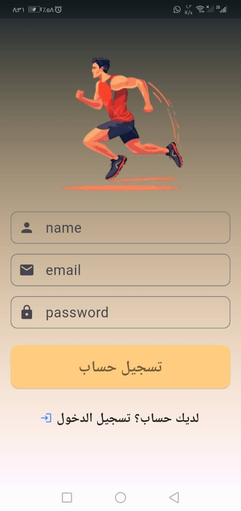
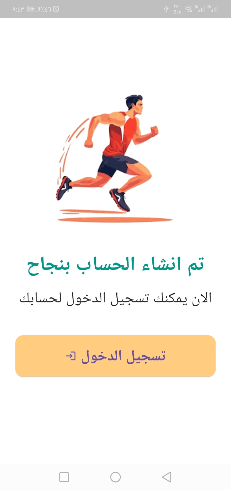
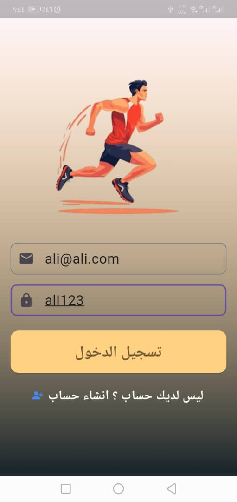
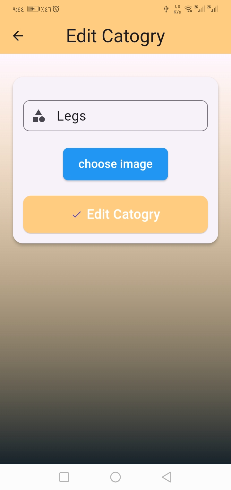

# 📱 تطبيق Fitness 
- Front-end

هذا المستودع يحتوي على الواجهة الأمامية لتطبيق اللياقة البدنية، تم تطويره باستخدام إطار **Flutter**.  
يرتبط هذا التطبيق بواجهة خلفية (Back-End) تم تطويرها باستخدام PHP وMySQL.

---

## 🚀 تشغيل التطبيق

### ✅ المتطلبات الأساسية:

- Flutter SDK مثبت على جهازك  
- Android Studio أو VS Code (مع إضافات Flutter وDart)

---

## 🛠️ خطوات التشغيل

لتشغيل التطبيق اولا عليك بتنزل الباك اند الخاص بالتطبيق وتشغيله واتبع التعليمات لتشغيل السيرفر دون مشاكل https://github.com/SalemBarshed7/Backend-for-Fitness-app

ثانيا قبل بدء تشغيل التطبيق قم بمسح الذاكره الموقته للتطبيق عن طريق امر flutter clean وبعدها قم بتنزيل البكجات مجددا لتجنب التعارض عبر امر flutter pub get  

في الاخير قبل بدء تشغيل التطبيق قم بالدخول لملف المشروع ادخل للمجلد 

constant في ملف

link_api.dart 

وقم بتغيير const String linkserver = "http://your_ip/first_app_api"; 

الى الايبي الخاص بالباك اند اللذي قمنا بشرح طريقته في هاذا الرابط https://github.com/SalemBarshed7/Backend-for-Fitness-app 

ختاما قم بجعل linkserver مشابهه للايبي الخاص بجهازك لمعرفه ماهو ايبي جهازك قم بالدخول cmd وقم بعمل الامر ipconfig سيضهر معاك الايبي الخاص بك 

اما اذا كنت ستعمل عن طريق Eimulator قم بجعل linkserver بالايبي هاذا 10.0.2.2

## الواجهات 

# صفحه تسجيل مستخدم جديد

## path : lib/app/auth/sign.dart

# صفحه تضهر بعد تسجيل مستخدم جديد

## path : lib/app/auth/Sucss.dart

# صفحه تسجيل الدخول

## path : lib/app/auth/login.dart

# صفحه الهوم الرئيسيه

## path : lib/app/home.dart

# صفحه اضافه تمرين جديد او فئه جديده

## path : lib/app/Catogry/addcatogry.dart

# صفحه تعديل التمرين او الفئه

## path : lib/app/Catogry/editcatogry.dart

# لحذف التمرين

## path : lib/app/home.dart
